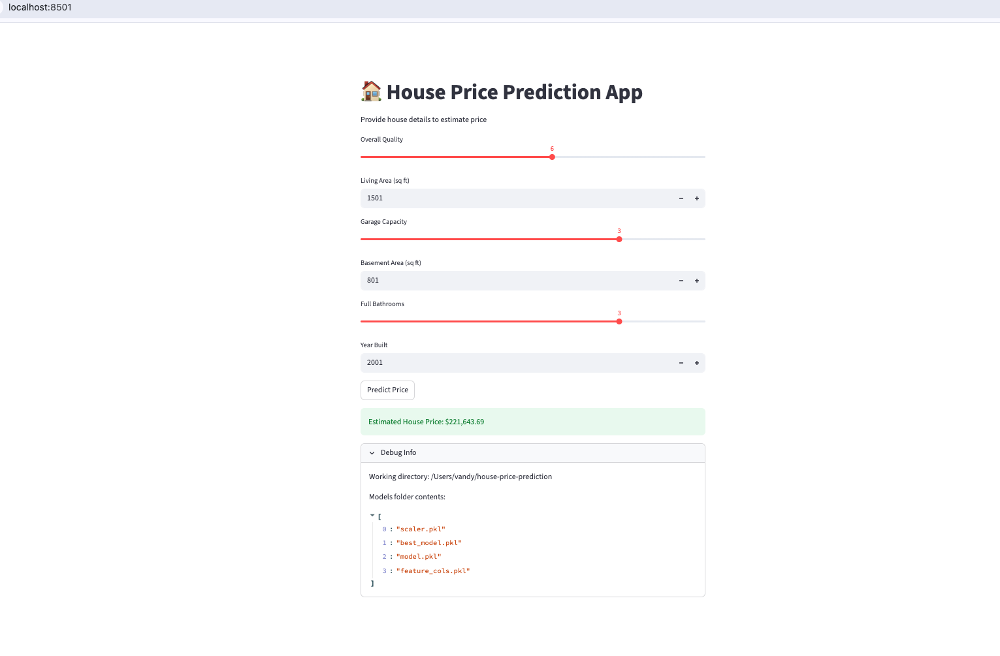

# 🏠 House Price Prediction (Regression ML App)

A machine learning project that predicts house prices using regression models and provides an interactive Streamlit web app for real-time predictions.

---

## 🚀 Quick Demo

Run locally in under 60 seconds:

```bash
git clone https://github.com/ranavandana94/Regression_HousePricePredictionModel.git
cd Regression_HousePricePredictionModel
pip install -r requirements.txt
streamlit run app.py
```

---

## 📌 Problem Statement

Accurately estimating house prices is critical for buyers, sellers, and real estate professionals.
This project builds a regression model using housing features to predict sale prices.

---

## 🧠 Solution Overview

This project follows a complete ML pipeline:

1. **Data Preprocessing**

   * Handle missing values
   * Feature engineering
   * One-hot encoding for categorical features

2. **Feature Scaling**

   * StandardScaler applied to numeric features

3. **Model Training**

   * Linear Regression
   * Random Forest Regressor
   * Best model selected based on RMSE

4. **Evaluation**

   * Metric: Root Mean Squared Error (RMSE)

5. **Deployment**

   * Streamlit app for user interaction

---

## 📊 Dataset

* Source: Kaggle House Prices Dataset
* Target Variable: `SalePrice`
* Features: 200+ after encoding

---

## ⚙️ Tech Stack

* Python
* Pandas, NumPy
* Scikit-learn
* Streamlit
* Joblib

---

## 📁 Project Structure

```
Regression_HousePricePredictionModel/
│
├── src/
│   ├── preprocess.py      # Data cleaning & feature engineering
│   ├── train.py           # Model training & selection
│   ├── evaluate.py        # Evaluation metrics
│   ├── main.py            # Pipeline execution
│
├── models/
│   ├── best_model.pkl
│   ├── scaler.pkl
│   ├── feature_cols.pkl
│
├── data/
│   └── train.csv
│
├── app.py                 # Streamlit application
├── requirements.txt
└── README.md
```

---

## 📈 Model Performance

| Model             | RMSE    |
| ----------------- | ------- |
| Linear Regression | ~25,535 |
| Random Forest     | ~29,390 |

👉 **Best Model:** Linear Regression

---

## 🖥️ Streamlit App

The app allows users to input:

* Overall Quality
* Living Area
* Garage Capacity
* Basement Area
* Bathrooms
* Year Built

And returns:

👉 **Estimated House Price**

---

## 🖥️ App Screenshot




---


## ⚠️ Limitations

* UI uses limited input features (model trained on 200+ features)
* Missing advanced models like XGBoost
* No hyperparameter tuning yet

---

## 🚀 Future Improvements

* Convert to **sklearn Pipeline (single model file)**
* Add more input fields in UI for better accuracy
* Try advanced models (XGBoost, LightGBM)
* Deploy on Streamlit Cloud

---

## 🤝 Contributing

Pull requests are welcome. For major changes, please open an issue first.

---

## 👤 Author

**Vandana Rana**
GitHub: https://github.com/ranavandana94
